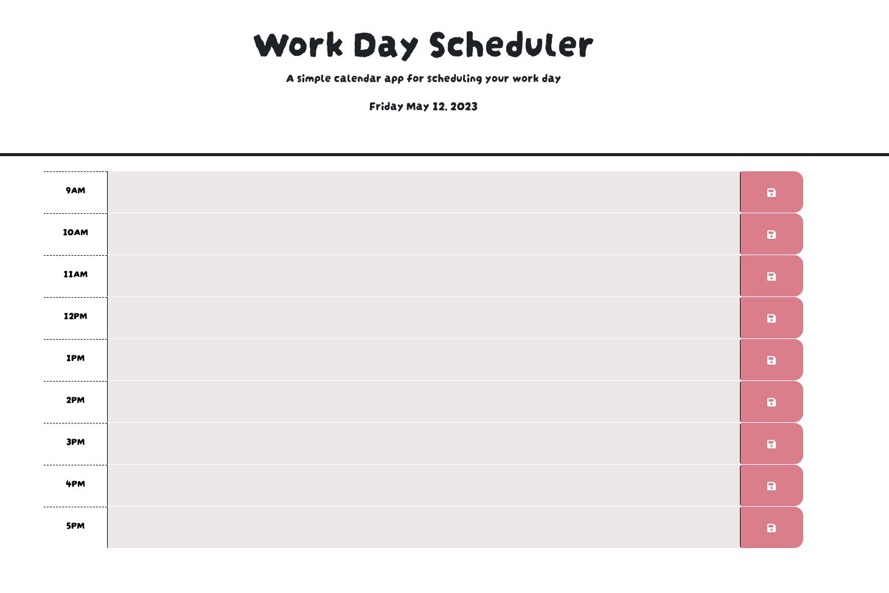

# Work Day Scheduler

## What is it?
It is a scheduler that allows us to save events. It comes in different color-coded timeblocks that indicate whether it is in the past, present or future.
The calendar clear itself everyday at 6:00 pm and you will be alerted if you are trying to schedule something in the past hours.

## Languages/APIs
    * HTML
    * CSS
    * JS
    * Bootstrap
    * jQuery
    * Day.js

## Preview

## Live Site
https://aleenabrink93.github.io/WorkDayScheduler/

  
